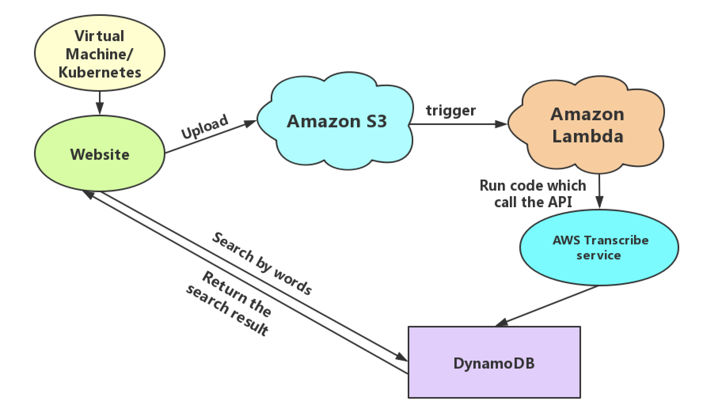

# Google Photos for Audios Proposal
## 1. Vision and Goals Of The Project
Google Photos for Audio will be a full-stack project. The <strong>minimum viable product</strong> would meet the requirement that:
* Users can upload media files in the front-end.
* Users can search for media using words found in their audio content.  
## 2. Users/Personas Of The Project
* Google Photos for Audio will be used by people who want to store and organize video and audio files in a user-searchable manner on the cloud. 
* These people include journalists, academic researchers, and reporters who need to be able to search through the files with keywords. This includes those who already using services such as Google Photos, Flickr, and Imgur.
## 3. Scope and Features Of The Project:
* Presents a concise and understandable UI for users.
   * Support registration and login and logout operations
   * Upload media files easily by dragging or choosing files.
   * After search with certain words, will return all the possible media files.
   * Could share albums with others using others' ID.
* As the developers, we can manage/monitor all the back-end services using AWS Lambda or kubernetes.
* Security: Provides secure storage and processing of user credentials, service and project data.
* Processing capacity: Can support a large number of users using and process files at the same time.
## 4. Solution Concept
### High-Level architecture and goals:
* Upload the media files in S3, an object storage service.
* An upload event will be pushed to AWS Pub/Sub topic.
* Use AWS Lambda to watch for the pubsub topic and process the uploaded file to translate audio to text, using AWS Transcribe service.
* Store the analysis result into a database, queryable by our website.
* The site can run on either a Virtual Machine (VM) or as a K8s service.
The diagram of whole project's structure is as followed.

### Design Implications and Discussion
* Why we choose AWS not GCP:
Actually they are pretty similar and brand new for most of us. Both have strong function on cloud and database. After do some research we found that AWS have some more understandable tutorials to followed and perhaps have a larger user group, so we choose AWS instead of GCP.
* Why DynamoDB not MongoDB
Both of them are NoSQL databases. DynamoDB is popular in the gaming industry as well as in the internet of things (IoT) industry. One fearure of DynamoDB is that you can’t have embedded data structures like you can with MongoDB. But Since we've already decided to use the AWS stack and we need a NoSQL database, then DynamoDB is a no-brainer.
* Front-end part
We decide to use NodeJS to implement our website. So the NodeJS is a convenient tool to write javascript code on server side. And for now, Node is definetely the hippest, the trendiest IT technology for people to learning right now, this project is a good oppotunity to learn it.
## 5. Acceptance criteria
* Minimum acceptance criteria is a website which support upload media files and search by words operations.
* Stretch Goal:
    * Automate the creation of various cloud resources using an infrastructure-as-code framework like Terraform.
    * Use k8s to watch for the pubsub topic and process the uploaded file to translate audio to text.
    * Use a self-deployed kafka to better the message stream process.
## 6. Release Planning
